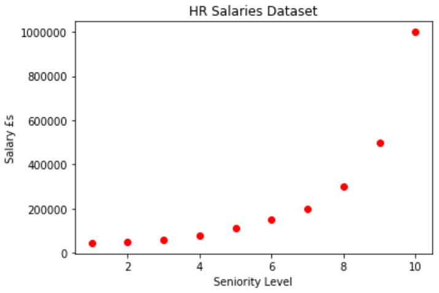
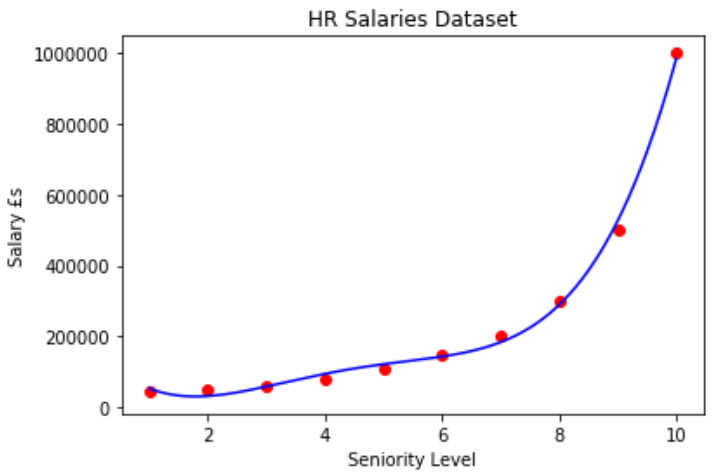

# HR Salary Justification

Polynomial regression is also referred to as Polynomial Linear Regression as "Linear" refers to the coefficients of the (X)^i terms. We do not require feature scaling as we are only adding polynomial terms to the multiple linear regression function, therefore using the linear regression library (sklearn.linear_model).

**Pros of Polynomial Regression:**

- Works on any size of dataset 
- Works very well on non-linear problems.

**Cons of Polynomial Regression:**

- Need to choose the right polynomial degree for a good bias/variance trade off.

**Task:**

We are working within the HR department in a company and are about to hire a new employee. We are about to negotiate the salary. The new hire has 20+ years of experience and says he/she used to earn a salary of £160,000, therefore being the desired minimum salary for their new role. The HR team has reached out to the new hire's previous employer to verify, but they only sent back a table of salaries that the company uses to band their employees. They also stated that he/she was a regional manager for two years and it takes 4 years to go from regional manager to partner. Lets predict if his/her claim is truth or bluff. Our task therefore being to predict the salary of someone who is at level 6.5 (mid way between regional manager and partner). The dataset received from the new hire's company has been plotted on a scatter graph below.

The diagram below shows the Polynomial Regressor being applied to the dataset, along with a higher resolution plot (step size 0.01) for a smoother curve. 

The predicted salary for someone at level 6.5 has been predicted to be just under £159,000. Although this is just over £1,000 under the new hire's claimed previous salary, we accept the new hire's claim and state that the new hire was telling us the truth.

We will be solving a simple business task using Polynomial, Support Vector Machine, Decision Tree and Random Forest Regression.
