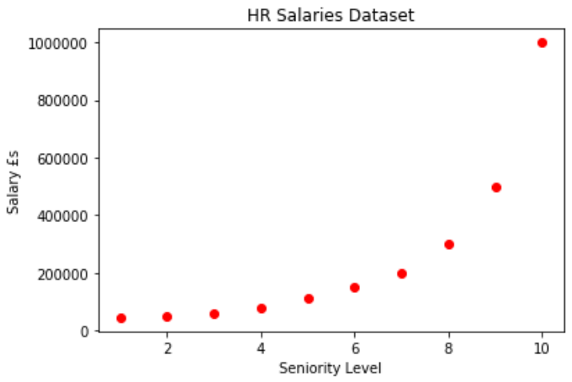

# HR Salary Justification

**Task:**

We are working within the HR department in a company and are about to hire a new employee. We are about to negotiate the salary. The new hire has 20+ years of experience and says he/she used to earn a salary of £160,000, therefore being the desired minimum salary for their new role. The HR team has reached out to the new hire's previous employer to verify, but they only sent back a table of salaries that the company uses to band their employees. They also stated that he/she was a regional manager for two years and it takes 4 years to go from regional manager to partner. Lets predict if his/her claim is truth or bluff. Our task therefore being to predict the salary of someone who is at level 6.5 (mid way between regional manager and partner).

We will be completing this task using Polynomial, Support Vector Machine, Decision Tree and Random Forest Regression.

## Polynomial Linear Regression

Polynomial regression is also referred to as Polynomial Linear Regression as "Linear" refers to the coefficients of the (X)^i terms. We do not require feature scaling as we are only adding polynomial terms to the multiple linear regression function, therefore using the linear regression library (sklearn.linear_model).

**Pros of Polynomial Regression:**

- Works on any size of dataset 
- Works very well on non-linear problems.

**Cons of Polynomial Regression:**

- Need to choose the right polynomial degree for a good bias/variance trade off.

 The dataset received from the new hire's company has been plotted on the scatter graph below. 

The diagram below shows the Polynomial Regressor being applied to the dataset, along with a higher resolution plot (step size 0.01) for a smoother curve. 

The predicted salary for someone at level 6.5 has been predicted to be just under £159,000. Although this is just over £1,000 under the new hire's claimed previous salary, we accept the new hire's claim and state that the new hire was telling us the truth.

## Support Vector Machine - SVR

Support vector machines (SVM) support linear and non-linear regression that we refer to as SVR. SVR performs linear regression in a higher dimensional space. The vector we get when we evaluate the test point for all points in the training set is the representation of the test point in the higher dimensional space. Once we have that vector we use it to perform a linear regression. The work of the SVM is to approximate the function we used to generate the training set F(X) = y

The vectors closest to the test points are referred to as the support vectors. We can evaluate our function anywhere so any vectors could be closest to our test evaluation location. Please see the diagram below for clarification.

**Note:**

SVR has a different regressional goal compared to linear regression. In linear regression, we are trying to minimise the error between the prediction and data. In SVR however, our goal is to make sure that errors do not exceed our threshold.

**Pros of SVR:**

- Easily adaptable
- Works very well on non-linear problems 
- Not biased by outliers.

**Cons of SVR:**

- Compulsory to apply feature scaling
- Not as well known 
- Can be difficult to understand.

We will be solving a simple business task using Support Vector Regression.

**Task:**

We are working within the HR department in a company and are about to hire a new employee. We are about to negotiate the salary. The new hire has 20+ years of experience and says he/she used to earn a salary of £160,000, therefore being the desired minimum salary for their new role. The HR team has reached out to the new hire's previous employer to verify, but they only sent back a table of salaries that the company uses to band their employees. They also stated that he/she was a regional manager for two years and it takes 4 years to go from regional manager to partner. Lets predict if his/her claim is truth or bluff. Our task therefore being to predict the salary of someone who is at level 6.5 (mid way between regional manager and partner). The dataset received from the new hire's company has been plotted on a scatter graph below.

In this analysis, we are choosing the Gaussian RBF Kernel (Radial Basis Function) and regularisation as due to the training sets with noise, the reguliser will prevent wild fluctuations between data points by smoothing out the prior. Any points away from the SVR curve will be treated as an outlier (as illustrated by the salary of the CEO in our dataset).

The diagram below shows the SVR being applied to the dataset, along with a higher resolution plot (step size 0.01) for a smoother curve. 

The predicted salary for someone at level 6.5 has been predicted to be just over £170,000, being in support of the new hire's claim. We therefore state that the new hire was telling us the truth.
